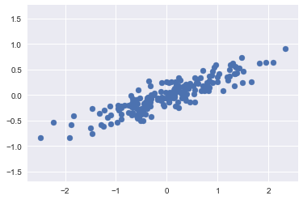
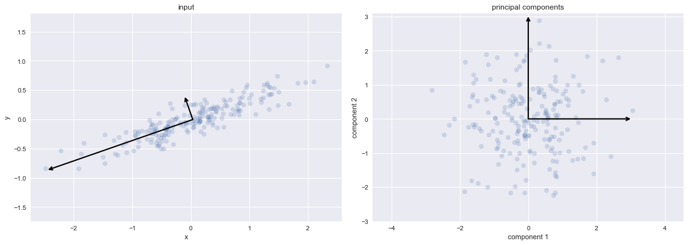
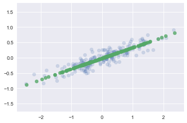
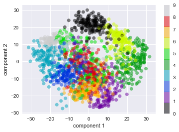
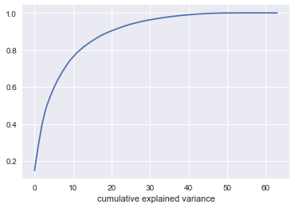
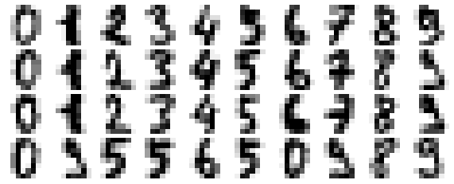
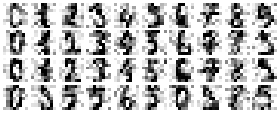
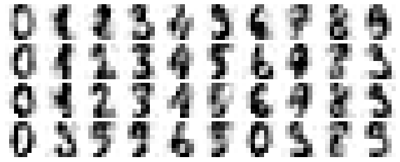

```python
%matplotlib inline
import numpy as np
import matplotlib.pyplot as plt
import seaborn as sns; sns.set()


def np_summary(np_array):
    if np_array is None:
        print('\nNone')
    else:
        dim = np.ndim(np_array)
        print('\nndim: %s / shape: %s / size: %s' %(np.ndim(np_array), np.shape(np_array), np.size(np_array)))
        if dim > 1:
            t = 'np_array[:5' 
            for i in range(dim-1):
                if i == 0:
                    t += ',:20'
                else: t += ',:5'
            t += ']'
            print(eval(t))
        else:
            print(np_array[:20])
```


```python
rng= np.random.RandomState(1)
X = np.dot(rng.rand(2,2), rng.randn(2,200)).T
plt.scatter(X[:,0], X[:,1])
plt.axis('equal')
plt.show()
np_summary(X)
np.var(X[:,0])+ np.var(X[:,1])
```





    
    ndim: 2 / shape: (200, 2) / size: 400
    [[-0.62530162 -0.17006366]
     [ 0.96069503  0.5909006 ]
     [-0.59854339 -0.40259339]
     [-2.22805938 -0.53257674]
     [-0.46143006 -0.49886724]]


    0.77710434941419326


```python
from sklearn.decomposition import PCA
pca = PCA(n_components=2, whiten=True)
pca.fit(X)
```


    PCA(copy=True, iterated_power='auto', n_components=2, random_state=None,
      svd_solver='auto', tol=0.0, whiten=True)


```python
print(pca.components_)
print(pca.explained_variance_)

np.power(0.9445,2) + np.power(0.3286,2)
```

    [[-0.94446029 -0.32862557]
     [-0.32862557  0.94446029]]
    [ 0.7625315  0.0184779]


    1.0000582099999999


```python
def draw_vector(v0, v1, ax=None):
    ax = ax or plt.gca()
    arrowprops = dict(arrowstyle = '->',
                     linewidth = 2,
                     shrinkA = 0,
                     shrinkB = 0)
    ax.annotate('', v1, v0, arrowprops = arrowprops)

fig, ax = plt.subplots(1, 2, figsize=(16, 6))
fig.subplots_adjust(left=0.0625, right=0.95, wspace=0.1)

# plot data
ax[0].scatter(X[:, 0], X[:, 1], alpha=0.2)
for length, vector in zip(pca.explained_variance_, pca.components_):
    v = vector * 3 * np.sqrt(length)
    draw_vector(pca.mean_, pca.mean_ + v, ax=ax[0])
ax[0].axis('equal');
ax[0].set(xlabel='x', ylabel='y', title='input')

# plot principal components
X_pca = pca.transform(X)
ax[1].scatter(X_pca[:, 0], X_pca[:, 1], alpha=0.2)
draw_vector([0, 0], [0, 3], ax=ax[1])
draw_vector([0, 0], [3, 0], ax=ax[1])
ax[1].axis('equal')
ax[1].set(xlabel='component 1', ylabel='component 2',
          title='principal components',
          xlim=(-5, 5), ylim=(-3, 3.1))


plt.show()

print(list(zip(pca.explained_variance_, pca.components_)))
```





    [(0.76253150088261124, array([-0.94446029, -0.32862557])), (0.018477895513562572, array([-0.32862557,  0.94446029]))]
    
    ndim: 2 / shape: (200, 2) / size: 400
    [[ 0.77501786  0.43946956]
     [-1.22672528  1.89239746]
     [ 0.8335856  -1.24082757]
     [ 2.64493895  1.79548612]
     [ 0.72151892 -2.24121269]]


```python
#pca.transform?
print(X[0])
print(np.mean(X, axis=0))
print(X[0]-np.mean(X, axis=0))
print(pca.components_[0])
print(X[0,0]-np.mean(X[:,0]))
print(X[0,1]-np.mean(X[:,1]))
print(np.sqrt(pca.explained_variance_))
print(np.dot(X[0]-np.mean(X,axis=0), pca.components_[0].T)/np.sqrt(pca.explained_variance_[0]))
np_summary(X_pca)
```

    [-0.62530162 -0.17006366]
    [ 0.03351168 -0.00408072]
    [-0.6588133  -0.16598294]
    [-0.94446029 -0.32862557]
    -0.658813298008
    -0.165982939521
    [ 0.8732305   0.13593342]
    0.775017864414
    
    ndim: 2 / shape: (200, 2) / size: 400
    [[ 0.77501786  0.43946956]
     [-1.22672528  1.89239746]
     [ 0.8335856  -1.24082757]
     [ 2.64493895  1.79548612]
     [ 0.72151892 -2.24121269]]


```python
#PCA 응용 - 차원 축소
pca = PCA(n_components=1)
pca.fit(X)
X_pca = pca.transform(X)
X_new = pca.inverse_transform(X_pca)
plt.scatter(X[:,0], X[:, 1], alpha=0.2)
plt.scatter(X_new[:,0], X_new[:,1], alpha=0.8)
plt.axis('equal')
plt.show()
```





```python
#PCA 시각화
from sklearn.datasets import load_digits
digits = load_digits()
np_summary(digits.data)
digits.data.shape
```

    
    ndim: 2 / shape: (1797, 64) / size: 115008
    [[  0.   0.   5.  13.   9.   1.   0.   0.   0.   0.  13.  15.  10.  15.
        5.   0.   0.   3.  15.   2.]
     [  0.   0.   0.  12.  13.   5.   0.   0.   0.   0.   0.  11.  16.   9.
        0.   0.   0.   0.   3.  15.]
     [  0.   0.   0.   4.  15.  12.   0.   0.   0.   0.   3.  16.  15.  14.
        0.   0.   0.   0.   8.  13.]
     [  0.   0.   7.  15.  13.   1.   0.   0.   0.   8.  13.   6.  15.   4.
        0.   0.   0.   2.   1.  13.]
     [  0.   0.   0.   1.  11.   0.   0.   0.   0.   0.   0.   7.   8.   0.
        0.   0.   0.   0.   1.  13.]]


    (1797, 64)


```python
pca = PCA(2)
projected = pca.fit_transform(digits.data)
np_summary(projected)
plt.scatter(projected[:,0], projected[:,1],
           c = digits.target, edgecolor = 'none', alpha=0.5,
           cmap = plt.cm.get_cmap('nipy_spectral',10))
plt.xlabel('component 1')
plt.ylabel('component 2')
plt.colorbar()
```

    
    ndim: 2 / shape: (1797, 2) / size: 3594
    [[ -1.25946726  21.27488068]
     [  7.95759879 -20.76871407]
     [  6.99192842  -9.95597973]
     [-15.90611388   3.33244683]
     [ 23.30687029   4.26907436]]


    <matplotlib.colorbar.Colorbar at 0x207b1b75940>





```python
pca = PCA().fit(digits.data)
plt.plot(np.cumsum(pca.explained_variance_ratio_))
plt.xlabeldef plot_digits(data):
    fig, axes = plt.subplots(4, 10, figsize=(10, 4),
                             subplot_kw={'xticks':[], 'yticks':[]},
                             gridspec_kw=dict(hspace=0.1, wspace=0.1))
    for i, ax in enumerate(axes.flat):
        ax.imshow(data[i].reshape(8, 8),
                  cmap='binary', interpolation='nearest',
                  clim=(0, 16))
plot_digits(digits.data)('number of components')
plt.xlabel('cumulative explained variance')
```


    Text(0.5,0,'cumulative explained variance')





```python
def plot_digits(data):
    fig, axes = plt.subplots(4, 10, figsize=(10, 4),
                             subplot_kw={'xticks':[], 'yticks':[]},
                             gridspec_kw=dict(hspace=0.1, wspace=0.1))
    for i, ax in enumerate(axes.flat):
        ax.imshow(data[i].reshape(8, 8),
                  cmap='binary', interpolation='nearest',
                  clim=(0, 16))
plot_digits(digits.data)
plt.show()
```





```python
np.random.seed(42)
noisy = np.random.normal(digits.data, 4)
plot_digits(noisy)
```





```python
#분산의 50%만 보존
from sklearn.decomposition import PCA
pca =PCA(0.5).fit(noisy)
pca.n_components_
```


    12


```python
components = pca.transform(noisy)
np_summary(components)
filtered = pca.inverse_transform(components)
plot_digits(filtered)
#단, 원데이터 필요
```

    
    ndim: 2 / shape: (1797, 12) / size: 21564
    [[ -9.82613291  19.60311879  -3.49445446  15.18944378  -9.68064658
       -3.97375366   4.83158325   6.98797984  -4.74026972   7.26107832
        0.58419145   1.8438046 ]
     [ 14.65827166 -15.58079811  11.61685625 -11.40062003   5.42066782
      -11.28323994  -1.61040501  -7.19254252   4.97865027   5.96816258
        1.69008628  -7.38319027]
     [  5.30646513 -14.73205492   0.26421735 -10.775562   -21.95361945
       -2.70060087   0.50853871 -10.59058661   2.31744836  -4.26313868
       -2.47186264  -7.46461662]
     [-17.97946614   8.78339229  16.15549567 -10.49900793   5.11905111
       -1.17078704  -6.49141465   9.17915766   2.71205485   4.53905962
       -7.80508389  -4.1612774 ]
     [ 19.36434407   8.86888193   0.98957224 -11.32526702  -1.81013857
       -1.36043328  -0.9054773   14.95422147  -5.28846675  15.04119777
        6.65367902  -3.32977948]]




